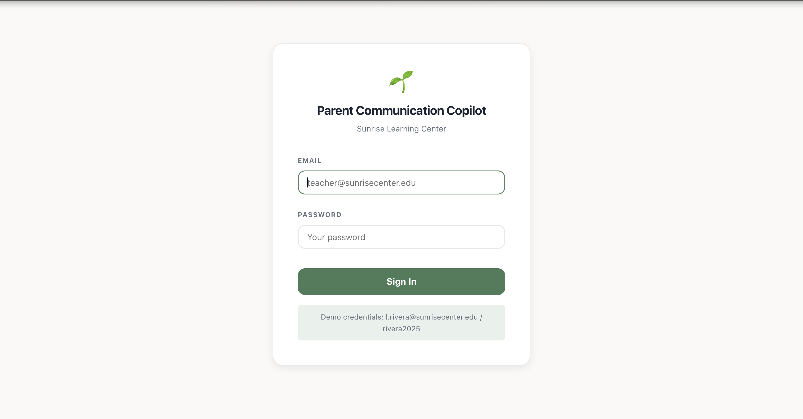
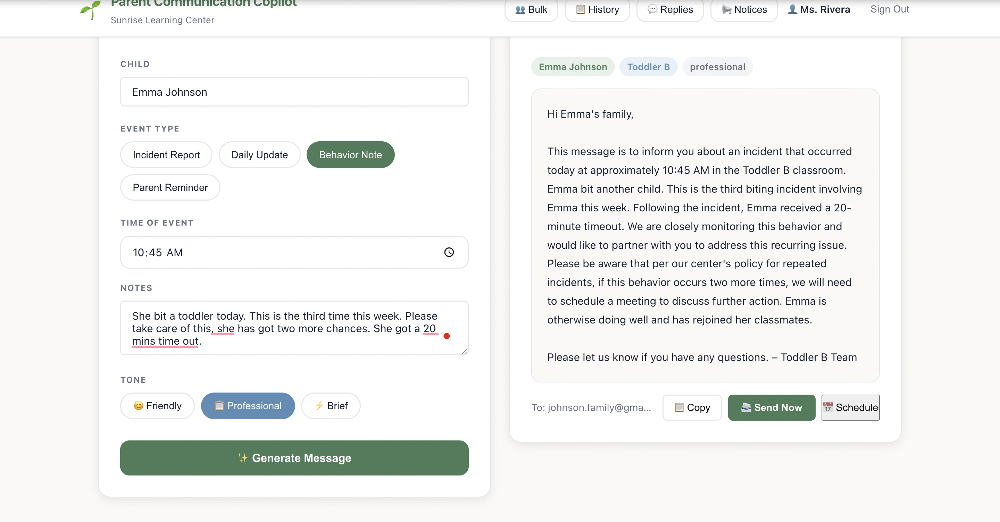
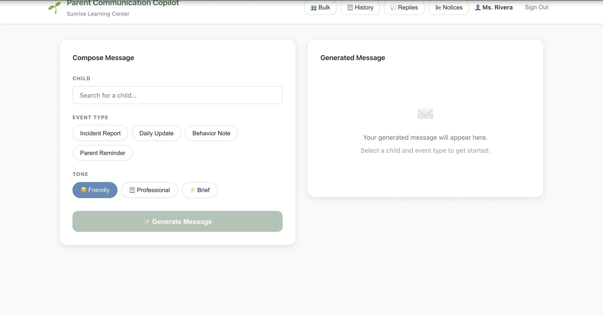
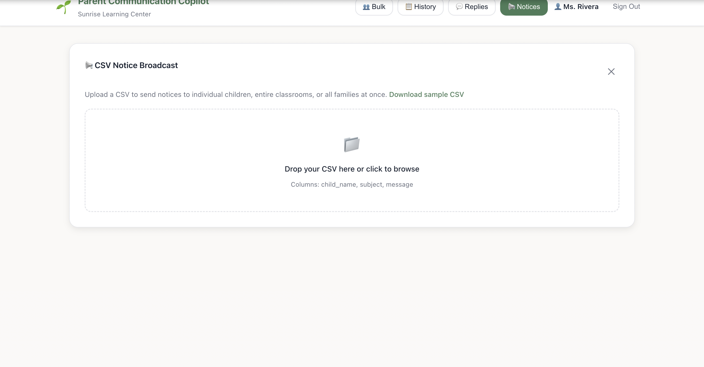
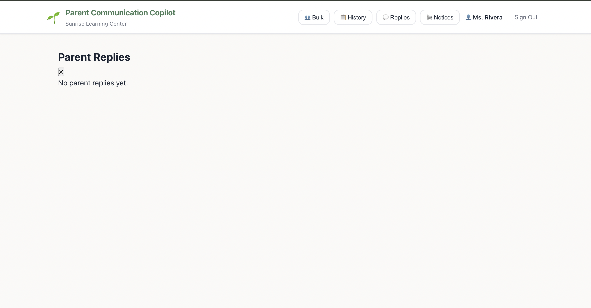

# Parent Communication Copilot

An AI-powered parent messaging demo built for childcare platforms like Playground. Teachers can generate polished, context-aware messages in seconds, send them with one click, manage message history, receive parent replies, and broadcast CSV-based notices to entire classrooms — all powered by Google Gemini AI.

## Why This Project

Playground solves a critical problem in childcare communication, but teacher workflows around messaging can still be repetitive and time-consuming.

This project explores how AI can:
- Reduce friction in daily teacher-parent communication
- Standardize tone and quality of messages
- Enable scalable, personalized messaging (bulk + individual)
- Improve responsiveness with two-way communication

Built as a prototype to demonstrate how this could integrate into a platform like Playground.

## Demo

**Login**


**Message Generator**


**Send Message**


**Bulk Messaging**


**Parent Reply**


## Key Design Decisions

- Used Gemini Flash for low-latency generation → suitable for real-time UI workflows
- Structured prompts using event templates to ensure consistent tone
- Built bulk messaging with per-message review to balance automation + control
- Used async FastAPI + APScheduler to support scheduling without blocking requests

---

## Features

### AI Message Generation
Teachers select a child, pick an event type (daily update, incident report, behavior note, reminder), choose a tone, and receive a warm, professional message instantly via Google Gemini.

### Teacher Authentication
Secure JWT-based login. Each teacher has a role-scoped account; all message actions are tied to the authenticated teacher. Demo credentials are shown on the login screen.

### Message History
A full log of every generated and sent message, with status badges (draft, sent, scheduled, cancelled). Scheduled messages can be cancelled directly from the history panel.

### Send & Schedule
Messages can be sent immediately (demo mode — logged and stored, no real email) or scheduled for a future date and time using APScheduler. The UI shows a datetime picker and confirms the scheduled delivery.

### Bulk Messaging
Select multiple children (grouped by classroom with select-all toggles), pick an event type and tone, and generate personalized messages for all of them at once. Review each generated message individually before sending, with per-message approve/remove controls.

### CSV Notice Broadcast
Upload a CSV file to send notices to individual children, entire classrooms, or all families at once. The upload preview shows each row's match status, recipient list, and any unmatched targets before sending. A sample CSV template is available for download.

**CSV format:**
```
child_name,subject,message
All,School Closure – Monday,The center will be closed Monday for staff development...
Toddler B,Weekly Update,What a wonderful week in Toddler B!...
Emma Johnson,Individual Note,Emma had a fantastic week...
```

Supported targets: a child's full name, a classroom name (e.g. `Toddler B`), or `All` for the entire center.

### Two-Way Parent Replies
Each sent message includes a unique reply link. Parents can open it without logging in, read the original message, and submit a reply. Teachers see unread reply counts in the header and can read, manage, and mark replies as read from the Reply Inbox panel.

### Demo Mode
All email delivery is simulated — messages are logged to the console and saved to the database with a fake delivery ID. A "Demo mode · Email delivery is future scope" label appears in the UI wherever sends occur.

---

## Tech Stack

| Layer | Technology |
|-------|-----------|
| Frontend | React 18, Vite, React Router v6 |
| Backend | FastAPI, Python 3.11 |
| Database | SQLite via SQLAlchemy 2.x (async) + aiosqlite |
| AI | Google Gemini (`gemini-1.5-flash`) |
| Auth | JWT (python-jose) + bcrypt (passlib) |
| Scheduling | APScheduler (AsyncIOScheduler) |
| Data seed | CSV files → SQLite on startup |

---

## Prerequisites

- Python 3.11+
- Node 18+
- A [Google Gemini API key](https://aistudio.google.com/app/apikey)

---

## Local Setup

### 1. Clone and enter the project

```bash
cd parent-comm-copilot
```

### 2. Backend

```bash
cd backend

# Create and activate a virtual environment
python -m venv .venv
source .venv/bin/activate        # Windows: .venv\Scripts\activate

# Install dependencies
pip install -r requirements.txt

# Configure your API key
cp ../.env.example .env
# Edit .env and set GEMINI_API_KEY=<your key>

# Start the API server
uvicorn main:app --reload --port 8000
```

The API will be available at `http://localhost:8000`.
Interactive docs: `http://localhost:8000/docs`

On first start the server seeds the SQLite database from the CSV files in `backend/data/` and prints demo login credentials to the console.

### 3. Frontend

```bash
cd frontend

# Install dependencies
npm install

# Start the dev server
npm run dev
```

Open `http://localhost:5173` in your browser.

---

## Demo Login

Teacher credentials are seeded automatically from `backend/data/teachers.csv`. The password format is `{lastname}2025` (lowercase).

Example: `l.rivera@sunrisecenter.edu` / `rivera2025`

All available credentials are printed to the backend console on startup.

---

## CSV Data Files

All center data lives in `backend/data/` as plain CSV files — editable in Excel, Numbers, or any text editor. Changes take effect on the next server restart.

| File | Contents |
|------|----------|
| `children.csv` | Child roster with classroom assignments, parent emails, and allergy notes |
| `classrooms.csv` | Classroom names and age groups |
| `teachers.csv` | Teacher roster with classroom assignments |
| `event_types.csv` | Available event categories and which fields they require |
| `incident_templates.csv` | Template messages used as LLM prompt examples |
| `sample_notices.csv` | Sample file for testing the CSV Notice Broadcast feature |

---

## Project Structure

```
parent-comm-copilot/
├── backend/
│   ├── main.py                  # FastAPI app, lifespan (DB seed, scheduler)
│   ├── database.py              # SQLAlchemy async engine + session factory
│   ├── auth.py                  # JWT utilities, get_current_teacher dependency
│   ├── scheduler.py             # APScheduler setup + scheduled delivery job
│   ├── data_loader.py           # CSV validation on startup
│   ├── routers/
│   │   ├── auth.py              # POST /auth/login
│   │   ├── children.py          # GET /children
│   │   ├── classrooms.py        # GET /classrooms
│   │   ├── events.py            # GET /events
│   │   ├── generate.py          # POST /generate-message
│   │   ├── send.py              # POST /send-message (immediate + scheduled)
│   │   ├── messages.py          # GET/DELETE /messages
│   │   ├── bulk.py              # POST /bulk/generate, /bulk/send
│   │   ├── replies.py           # GET/POST /reply/:token, GET /replies
│   │   └── notices.py           # POST /notices/upload, /notices/send, GET /notices/sample
│   ├── models/
│   │   ├── db_models.py         # SQLAlchemy ORM models
│   │   └── schemas.py           # Pydantic request/response models
│   ├── db/seed.py               # Seeds DB from CSVs on startup
│   ├── services/
│   │   ├── llm_client.py        # Abstract LLM base class
│   │   ├── gemini_client.py     # Google Gemini implementation
│   │   └── mock_llm_client.py   # Deterministic test double
│   ├── data/                    # CSV data files
│   └── tests/test_api.py        # pytest test suite
├── frontend/
│   ├── src/
│   │   ├── App.jsx              # Main dashboard shell + auth gate
│   │   ├── api.js               # Fetch wrappers for all endpoints
│   │   ├── main.jsx             # Router setup (/ and /reply/:token)
│   │   ├── pages/
│   │   │   └── ReplyPage.jsx    # Public parent reply page
│   │   └── components/
│   │       ├── LoginForm        # Email/password login
│   │       ├── ChildSelector    # Searchable child dropdown
│   │       ├── BulkChildSelector # Classroom-grouped multi-select
│   │       ├── EventForm        # Dynamic event detail form
│   │       ├── ToneSelector     # Friendly / Professional / Brief pills
│   │       ├── MessageOutput    # Result display, send, schedule
│   │       ├── BulkMessageReview # Per-message approve/send review
│   │       ├── MessageHistory   # Sent message log with cancel
│   │       ├── ReplyInbox       # Teacher inbox for parent replies
│   │       └── NoticeUploader   # CSV upload, preview table, broadcast
│   └── tests/App.test.jsx       # Vitest + React Testing Library suite
├── .env.example
└── README.md
```

---

## API Reference

| Method | Endpoint | Auth | Description |
|--------|----------|------|-------------|
| POST | `/auth/login` | — | Get JWT token |
| GET | `/children` | — | List all children |
| GET | `/classrooms` | — | List all classrooms |
| GET | `/events` | — | List event types |
| POST | `/generate-message` | ✓ | Generate AI message, save as draft |
| POST | `/send-message` | ✓ | Send or schedule a message |
| GET | `/messages` | ✓ | Message history |
| DELETE | `/messages/{id}` | ✓ | Cancel a scheduled message |
| POST | `/bulk/generate` | ✓ | Generate messages for multiple children |
| POST | `/bulk/send` | ✓ | Send a list of message IDs |
| GET | `/reply/{token}` | — | Get message context (parent-facing) |
| POST | `/reply/{token}` | — | Submit a parent reply |
| GET | `/replies` | ✓ | Teacher reply inbox |
| PUT | `/replies/{id}/read` | ✓ | Mark reply as read |
| POST | `/notices/upload` | ✓ | Parse and preview a notices CSV |
| POST | `/notices/send` | ✓ | Demo-send all matched notice rows |
| GET | `/notices/sample` | — | Download sample CSV template |

Full interactive docs at `http://localhost:8000/docs`.

---

## Running Tests

### Backend (pytest)

```bash
cd backend
source .venv/bin/activate
pytest tests/ -v
```

All tests use `MockLLMClient` — no Gemini API key required.

### Frontend (Vitest)

```bash
cd frontend
npm test
```

---

## Future Scope

- **Real email delivery** — replace the demo stub in `send.py` with Resend, SendGrid, or the childcare platform's own messaging API
- **Playground API integration** — sync children, classrooms, and teachers directly from the platform instead of CSV files
- **Role-based access** — restrict teachers to their own classrooms
- **Gemini rate limiting** — add retry logic or a request queue for high-volume use
- **Push notifications** — notify teachers of new parent replies in real time
- **Message templates** — allow teachers to save and reuse their favorite message structures

---

## Production Considerations

- Replace demo email system with Playground messaging APIs
- Add rate limiting + queueing for LLM requests
- Move from SQLite → PostgreSQL
- Add RBAC for teacher/classroom isolation
- Add observability (logging, metrics, retries)